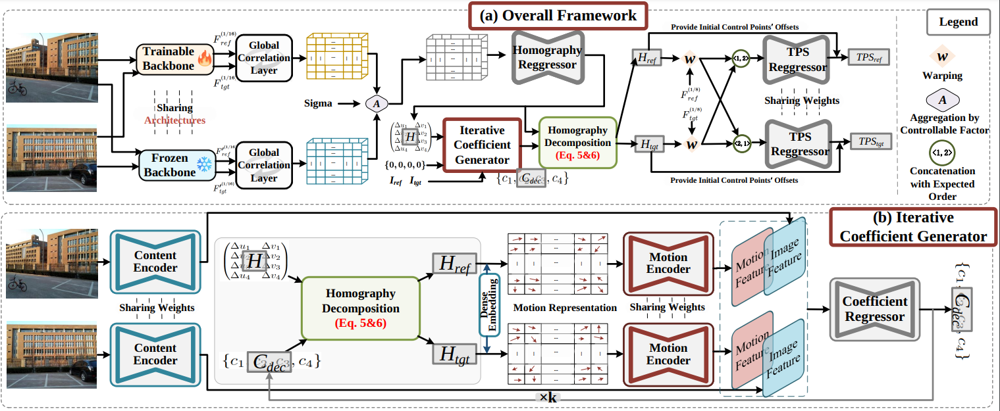

# <p align="center">Robust Image Stitching with Optimal Plane</p>
<p align="center">Lang Nie<sup>∗</sup>, Yuan Mei<sup>†</sup>, Kang Liao<sup>‡</sup>, Yunqiu Xu<sup>§</sup>, Chunyu Lin<sup>¶</sup>, Bin Xiao<sup>∗</sup></p> 
<p align="center"><sup>∗</sup> Chongqing Key Laboratory of Image Cognition, Chongqing University of Posts and Telecommunications</p> 
<p align="center"><sup>†</sup> The Hong Kong Polytechnic University</p> 
<p align="center"><sup>‡</sup> Nanyang Technological University</p> 
<p align="center"><sup>§</sup> Zhejiang University</p> 
<p align="center"><sup>¶</sup> Beijing Jiaotong University</p>



## TODO

- **Model**
  - [✖️] Upload pretrained model
  - [✖️] Ternary search optimization

- **Dataset**
  - [✖️] Upload classical dataset

## Dataset
We use the UDIS-D dataset to train and evaluate our method. Please refer to [UDIS](https://github.com/nie-lang/UnsupervisedDeepImageStitching) for more details about this dataset. For cross-scenario validation, we have assembled 147 pairs of traditional image stitching pairs, and the associated dataset is available for download [here]().


## Code
#### Requirement
numpy >= 1.19.5

pytorch >= 1.7.1

scikit-image >= 0.15.0

tensorboard >= 2.9.0

## Training
### Step1: Training the Aligment Model
```
cd ./woCoefNet/Codes/
python train.py
```

### Step2: Training the Iterative Coefficient Generator

```
cd ./wCoefNet/Codes/
python train.py --woCoefNet_path your_model_path
```

## Testing 
Our pretrained models can be available at [Google Drive]().

```
cd ./wCoefNet/Codes/
python test.py --woCoefNet_path your_model_path
```

## Fine-tuning

```
cd ./wCoefNet/Codes/
python test_finetune.py --woCoefNet_path your_model_path
```

## Meta
If you have any questions about this project, please feel free to drop me an email.

Yuan Mei -- 2551161628@qq.com
